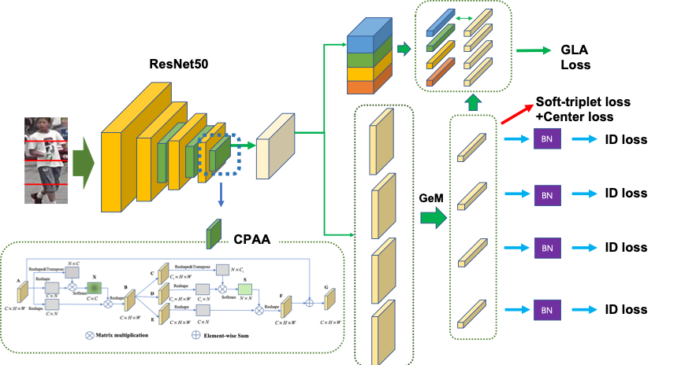

# Multiple-local Feature and Attention Fused Person Re-identification Method




### Quick Start

#### 1. Prepare dataset 
Create a directory to store reid datasets under this repo, taking Market1501 for example
```
cd MFA
mkdir toDataset
```
- Set ```_C.DATASETS.ROOT_DIR = ('./toDataset')``` in```config/defaults.py```
- Extract dataset and rename to ```market1501```. The data structure would like:
```
toDataset
    market1501 
        bounding_box_test/
        bounding_box_train/
        ......
```

Partial-REID and Partial-iLIDS datasets are provided by https://github.com/lingxiao-he/Partial-Person-ReID

#### 2. Install dependencies

  - pytorch=1.0.0
  - torchvision=0.2.1
  - pytorch-ignite=0.1.2
  - yacs
  - scipy=1.2.1
  - h5py
  
#### 3. Train

To train a MFA model with on Market1501 with GPU device 0, run similarly:
```
python3 tools/main.py --config_file='configs/MFA_baseline.yml' MODEL.DEVICE_ID "('0')" DATASETS.NAMES "('market1501')" OUTPUT_DIR "('./log/market1501/Experiment-MFA-baseline')"
```

#### 4. Test

To test a MFA model with on Market1501 with weight file ```'./pretrained/dukemtmc_MFA.pth'```, run similarly:
```
python3 tools/main.py --config_file='configs/MFA_baseline.yml' MODEL.DEVICE_ID "('0')" DATASETS.NAMES "('market1501')"  MODEL.PRETRAIN_CHOICE "('self')" TEST.WEIGHT "('./pretrained/market1501_MFA.pth')" TEST.EVALUATE_ONLY "('on')" OUTPUT_DIR "('./log/Test')"
```


Contact: klaus007@yeah.net
